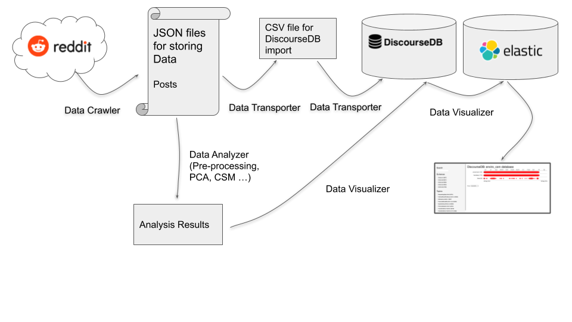
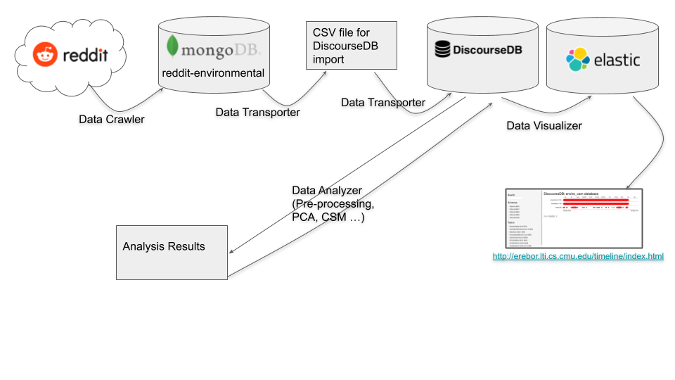

## This document describes the infrastructure and workflows of the project:
### Infrastructure
  1. Current infrastructure
  2. *Proposed* infrastructure
### Workflows
  1. Current workflow
  2. *Proposed* workflow

## Current Infrastructure
### Data Crawler
Crawl Reddit data (*posts only*) periodically and store them as JSON files.
### Data Transporter
Transport data from JSON files into DiscourseDB.
### Data Analyzer
Fetch data from JSON files, run data analysis and store results as txt files.
### Data Visualizer
Transfer analysis results to DiscourseDB, fetch data from DiscourseDB and visualize it using elastic.

## Current Workflow

 
## Proposed Infrastructure
### Data Crawler
Crawl Reddit data (*posts and comments*) periodically and store them in MongoDB.
### Data Transporter
Transfer data from MongoDB to DiscourseDB.
### Data Analyzer
Fetch data from DiscourseDB, run data analysis and plug results back into DiscourseDB.
### Data Visualizer
Fetch data from DiscourseDB and visualize data using elastic.

## Proposed Workflow

 
