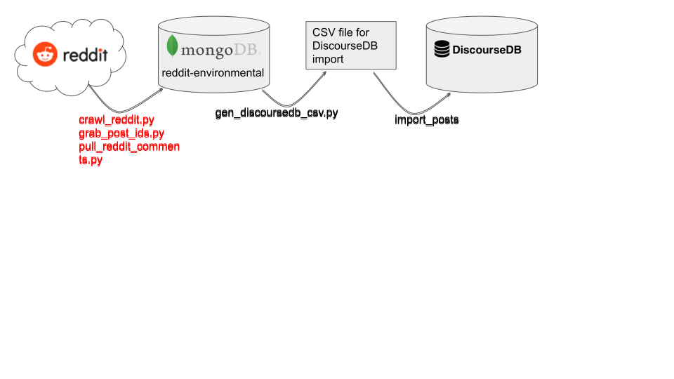
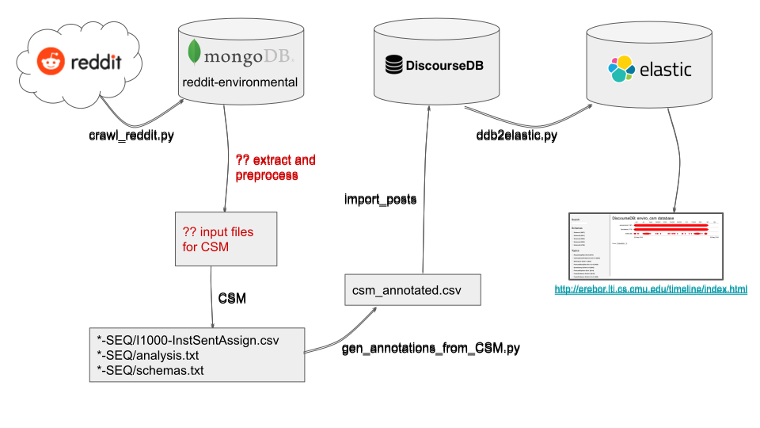
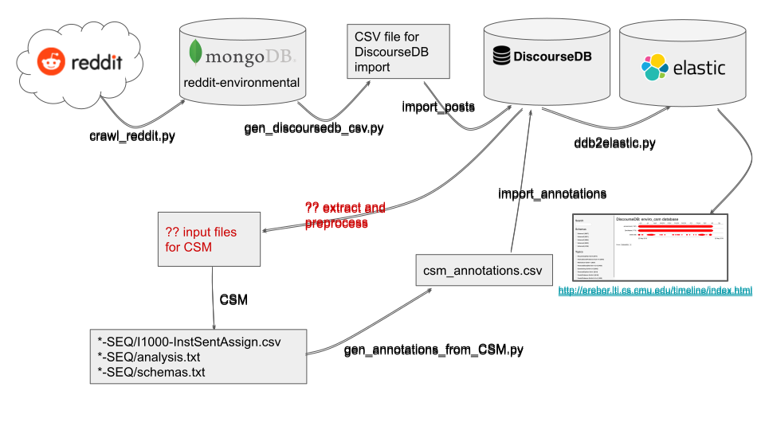

## This document describes three workflows:
  1. How data is scraped from reddit directly into Discoursedb without analysis
  2. How data is scraped from reddit, analyzed, piped through discoursedb into a visualization engine
  3. A *planned* pipeline that routes data through DiscourseDB before analysis

## Current scraping into text database
  * crawl_reddit.py is called periodically by a cron job, checking the Reddit API for new posts associated with a list of subreddits of interest.  It puts the JSON records it retrieves into a mongo database (in collection `posts`) and updates a latest retrieval date in collection `scrapedates` for each subreddit.
  * gen_discoursedb_csv.py is also called periodically; it extracts new mongo records and prepares [a CSV file needed for import into DiscourseDB](https://github.com/DiscourseDB/discoursedb-core/tree/master/discoursedb-io-csv)
  * Finally, a DiscourseDB scriptk, [import_posts](https://github.com/DiscourseDB/discoursedb-core/blob/master/discoursedb-io-csv/import_posts_split), is called which imports that CSV file into discourseDB.
  * That data is available as unannotated text in [DiscourseDB](http://discoursedb.github.io) (currently in database EnviroReddit).

## Current scraping and analysis for visualization

## Future pipeline

Note: the original diagrams can be edited here: [Google presentation document](https://docs.google.com/presentation/d/1PVBqB9JszFavSs7fRTzZDT2bMSakVAS9y4JjEq8TZrM/edit#slide=id.g5195033c36_0_91)
